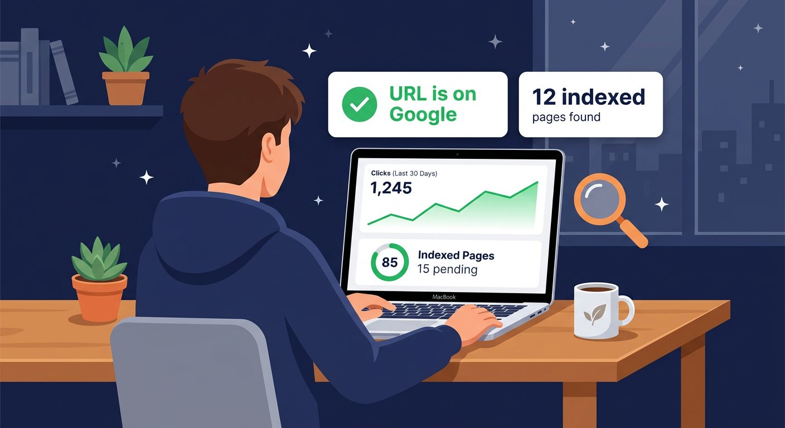
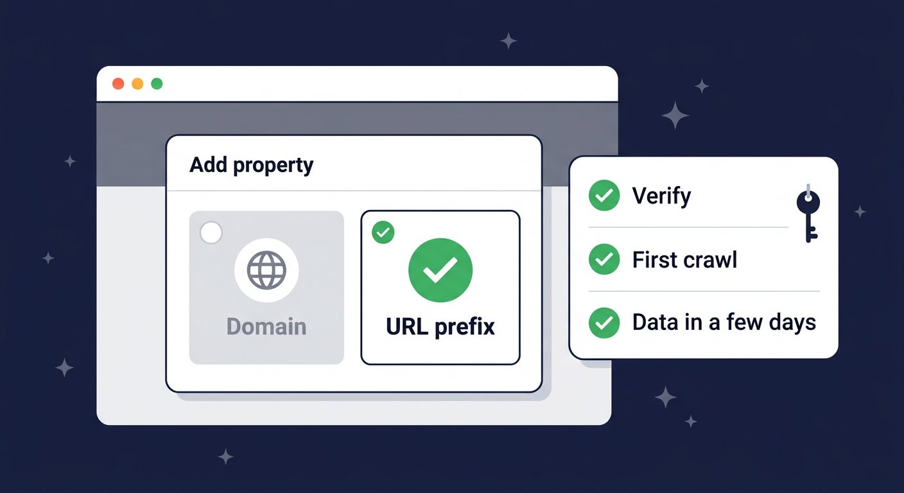
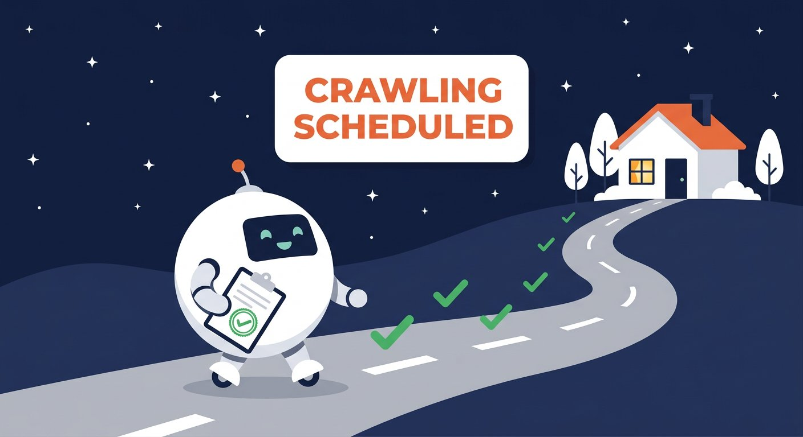
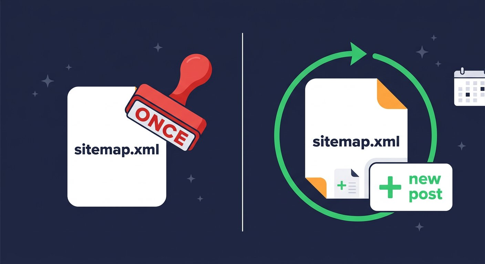

<!--
Post for Blogger (Free Stack Hub)

*The moment the dashboard stops guessing and tells you, in so many words, that Google has your page.*

I published my third post on this blog and waited the way you wait for a text back: checked, checked, checked again. Five days later, my own post had zero results on Google, and the strangest part was that nothing was wrong with the post. It was just sitting there, invisible, because I had never opened the one free tool that tells you why. It is not a magic button, and once you see what it actually is, the whole "why can't I find my site" panic gets a lot smaller.

<!-- jump break: in Blogger put the cursor here and use Insert > Jump break -->

TITLE:  Google Search Console from Zero: Add a Property, Inspect a URL, Request Indexing, Submit a Sitemap
LABELS: Google Search Console, SEO, Indexing, Sitemap, Blogger
SEARCH DESCRIPTION: Search Console in plain English: add and verify a property, inspect a URL, request indexing, read sitemap statuses, and find out whether you resubmit.

IMAGES: keep the 6 files in ./images/ and reference them by bare file name in
post.html; the build rewrites them to public CDN URLs. Nothing is uploaded by hand.

HOW TO PUBLISH: python3 tools/build_import.py <folder>, then import that folder's
import.xml (Blogger > Settings > Manage blog > Import content). paste.html is the
body-only fallback and loses title/labels/description. Verify with
python3 tools/check_published.py <folder>. Videos: python3 tools/make_video.py <folder>.
-->

# Google Search Console from Zero: Add a Property, Inspect a URL, Request Indexing, Submit a Sitemap

## First, what this tool actually is

Google Search Console is a free dashboard that shows you your website through Google's eyes. That is the whole pitch, and it is easier to show than to say: which of your pages Google has crawled, which ones it decided to put in search results, which ones it excluded and why, when the crawler last visited, and how your submitted sitemap is doing. Clicks and impressions from search come with it too, but that is a later post.

What it is not: it is not a ranking machine, and nothing you click in there is a command. It is a window. And it is blind to your site until you register the site in it, which is where the whole process starts.

## Adding your property (the part everyone rushes)

Go to **search.google.com/search-console** and sign in with the Google account you want tied to the site. In the top left you will see a button that says **Add property**, and Google offers two flavours:

- **Domain.** You type the bare domain, no http, no www, and it covers everything under it, every protocol and every subfolder. Verification needs a DNS record at your domain host, which is the fiddlier path.
- **URL prefix.** You type the exact start of your address, for example `https://yourblog.blogspot.com`. Verification is easier, and the property covers just that prefix.

For a regular blog, pick URL prefix. There is nothing to gain from the Domain route and a whole extra login at your domain registrar to pay.

Now choose a verification method. Search Console lists several (a DNS record, an HTML tag, uploading an HTML file, Google Analytics, Google Tag Manager), and for a Blogger blog the practical one is the **HTML tag**. Google gives you a one-line tag, something like a `<meta>` with a long ID in it. Copy it, open Blogger's **Theme** tab, click **Edit HTML**, paste the tag in right after the opening `<head>` line, save the theme, then go back to Search Console and press **Verify site**. Green tick. You are in.

*URL prefix for a blog, one meta tag in the theme, and the verification checklist starts ticking by itself.*

Two gotchas I would save you the trouble of discovering. One: the prefix has to match what you would type into the address bar, exactly, including the `https`. Blogger addresses have no `www` in front. Submit the wrong variant and you will be staring at a permanently empty dashboard wondering what broke; nothing broke, you just registered a different address. Two: verification is instant, but the reports are not. Give it a day or two before you conclude the tool is broken because everything is grey. The crawler has to walk the site first, and a fresh property gets its first walk in the background, quietly.

## URL inspection: "does Google have my page?"

Back at your Search Console home, there is a search box across the top. That is the **URL inspection** tool, and it is the five-second answer to the question that causes most of the panic: does Google actually have this page? Paste a full URL of one of your posts, with the `https://`, and press enter. A few seconds later it answers three things:

- **Is the page on Google?** You get a status line: "Page is on Google", "URL is on Google but not indexed", "Crawled - currently not indexed", or "URL is not on Google".
- **When did Google last look at it?** A last crawl date sits right there, which is more useful than you would expect.
- **If something is wrong, what is it?** Redirects, a `noindex` tag in your theme, a server error at crawl time, a page Google decided is a duplicate, each one gets named instead of left to you to guess.

The same screen has two buttons worth knowing. **View live test** makes Google fetch the page right now, on a phone-sized profile, and shows you exactly what the crawler saw, down to the mobile preview of your post. **Page index status** shows the verdict from the last crawl. If you see "Crawled - currently not indexed", that is not an error: it means Google came, read the page, and (for now) declined to list it, and the report tells you the reason it thinks is the cause.

*One URL in, one verdict out. Most "why can't I find my site" spirals end on this screen.*

## Requesting indexing

At the bottom of that inspection screen sits the button: **Request indexing**. Here is what it does, precisely. It tells Google to fetch the page and consider it for the index. You get back a message along the lines of "Crawling scheduled", and if you inspect the same URL again after a while, the status walks through its stages: from not on Google to crawled, then, if the page survives Google's review, to "Page is on Google".

Two honest notes before you start clicking. First, there is a quota. Google allows only a small number of these requests per property per day, roughly ten to twenty in practice, and the button goes quiet when you spend them. That is by design, and it is the reason this is a tool for the pages that matter: the homepage, a post you just published and want found, a page you just fixed after it was excluded. It is not a substitute for a sitemap, and you should not burn the day's budget on old posts.

Second, a request is a nudge, not a command. If the page is a duplicate of something else you have, if it is thin, if it is sitting behind a `noindex` tag, Google will happily come and still say no. The button gets Google to look. It cannot force the listing, and any guide that promises otherwise is selling you a button that does not exist.

*"Crawling scheduled" is the part everyone misses: the request does not index the page, it gets the robot onto the road.*

## The "crawler request" you keep reading about

Older tutorials talk about "requesting a crawl", and for a while Google's own interface said the same thing. Today there is no separate crawl-request button in Search Console, because **Request indexing is the crawl request**. Scheduling the crawl is how the indexing request works under the hood, and the status messages, "Crawling started", "Crawling completed", are the receipt that the robot actually came. So when a guide says "request a crawl of your page", it is pointing at the same button.

If you want to *see* the crawler working rather than just ask for it, there are three places:

- **URL inspection**, which gives you the last crawl date for one page at a time.
- The **Pages** report in the left menu, which lists your pages with their index status and the date Google last looked at each one. This is the overview shot.
- **Crawl stats**, which hides in the gear icon under **Settings**, in the Crawling section, with an "Open report" link. It charts how many URLs Googlebot requested over the last few months, how much it downloaded, and how your server answered. For a small blog it is a nice picture of a quiet machine doing its rounds.

One thing the charts quietly teach you: a small blog gets crawled less often than a big one, because Google spreads its crawling across the whole web and big, constantly changing sites grab more of the budget. That is why a week-old post can still show a last crawl date of a week ago, and it is why the request button exists at all. You are not being ignored; you are just further down the queue.

## Submitting your sitemap

A sitemap is a plain XML file that lists your URLs so Google does not have to discover your site the slow way, by following links from elsewhere on the web. The good news for a Blogger blog: you already have one, and nobody asked you to write it. Type your blog address with `/sitemap.xml` on the end, open it, and you will get a small index file pointing at the sub-files that actually list your posts. Blogger rewrites it every time you publish, which matters more than it sounds.

In Search Console, open **Sitemaps** in the left menu, type `sitemap.xml` (or the full URL) into the box, and press **Submit**. A table appears, and the columns in that table are exactly what people mean when they talk about the status of a sitemap submission:

- **Status.** *Success* means Google downloaded the file and read it. *Pending* means you submitted it and Google has not looked yet, and that can sit for hours or a couple of days without anything being wrong. *Error* comes with a message, the URL does not exist, the file is not valid XML, it exceeds the limits, and the message is usually the fix as well.
- **Sitemap entries.** How many URLs Google found in the file. Watch this number grow as you publish, because it is the pipeline working, in a single integer.
- **Last submitted and last discovered.** When you sent it, and when Google last actually looked at it.

Keep one thing straight while you are here: a sitemap gets Google to your pages faster. It does not make them rank, and it does not even guarantee they get indexed. It is a map, not a vote, and the Pages report above it is the place that shows what Google decided to do with the map.

*Hand it over once, and the status column does the talking: Pending, then Success, with the entry count climbing.*

## Do you submit the sitemap once, or keep submitting?

This is the question that has no clean answer in most tutorials, so here it is, cleanly: **once, per file.** And then you leave the submit button alone, because of how the thing actually works.

When you submit a sitemap, you are not uploading a copy of it. You are telling Google where the file lives. After that, Google **re-downloads the file automatically whenever it detects a change**, which for a Blogger blog happens quietly in the background every time you publish a post. Your new post rewrites `sitemap.xml` on the spot, Google re-reads the file, notices the new URL, and the crawl queue does the rest. The proof is in the table itself: the "last discovered" date moves on its own. If you see it moving, the file is still being read, and there is nothing to do. The most productive sitemap routine is a calendar reminder that checks one date.

So the "one time or multiple times" question splits into three cases:

- **The submission is one-time.** Submitting the same file a second time, or deleting it and re-adding it every day, does not make Google crawl you faster. It just adds noise to the log, and if you hammer the button enough, Google starts throttling the property. The fastest way to slow your own sitemap down is to treat it like a slot machine.
- **The file is a living document.** It can change as often as you like, and it should. On Blogger you never touch it at all, because the platform rewrites it for you, and that is the whole point of a generated sitemap: you publish, the file follows, Google re-reads.
- **You submit again only when something new appears.** A brand-new sitemap file gets its own one-time submission. A file that used to say Success and now says Error gets fixed, then resubmitted under the same URL. A brand-new property gets the first submission of everything. That is the whole list.

*The whole policy in one picture: the stamp goes down once, the file keeps updating, and Google keeps reading.*

One line for the notebook: **submit once per file, update the file as often as you like.**

## A weekly ten minutes that is enough

Here is the routine I run now, and it takes ten minutes on a Sunday. I open the **Pages** report and glance at indexed versus excluded, which tells me whether the last few posts are moving into the index. I open **Sitemaps** and confirm it is still green and that the entries count went up. I use **Request indexing** on the one post from the week I actually want found, one button, once a week, which leaves most of the daily quota untouched. Then I close the tab.

Search Console will show you a lot of red on the excluded side, and most of it is normal: duplicate URLs, pages Google simply chose not to list, tag archives. You react to the red only when a page you care about is the one that is missing. Everything else is the sound of the machine working.

## Quick recap

1. Add your site as a property, URL prefix for a blog, and verify it with the meta tag pasted into your theme's `<head>`.
2. Use **URL inspection** to ask "does Google have this page?" and read the status it hands back, including the last crawl date and any named problem.
3. **Request indexing** is the crawl request: a daily-limited nudge for the pages that matter, never a guarantee.
4. Submit `sitemap.xml` under **Sitemaps** and read the status column: Pending is patience, Success is the goal, Error comes with its own fix.
5. Submission is one-time per file. The file updates itself as you publish, and Google re-reads it automatically, so the "last discovered" date moving on its own is the proof.
6. Ten minutes a week: Pages report, sitemap status, one indexing request for your best new post, then close the tab.

Do the first two steps tonight: the property plus the verification tag takes under ten minutes, and the sitemap can take its day to go green. Then come back and tell me in the comments how long your first post took to appear on Google, because I am collecting the worst numbers and I want to know where a brand-new blog sits on that scale. Next up: reading the **Performance** report, the one that finally answers who is searching for your topics and where you stand in the results.
