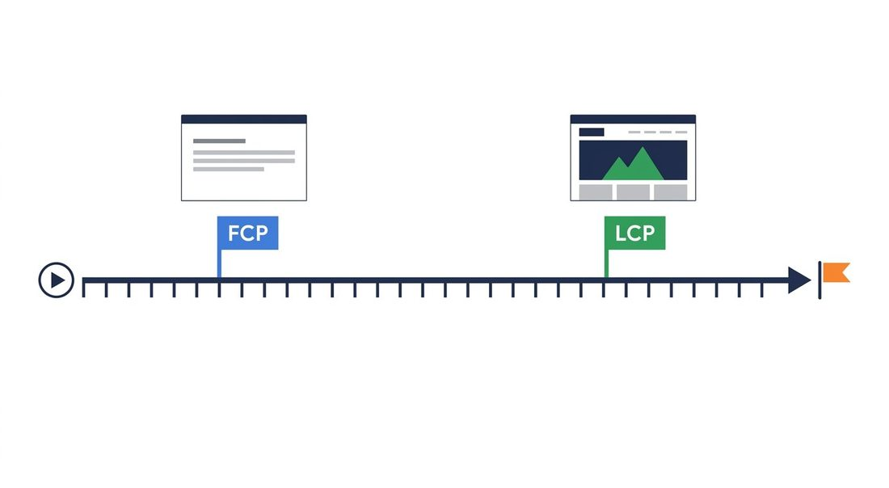

<!--
Post for Blogger (Free Stack Hub)


*The report I was trying to read at 11pm: one orange score, four gauges, zero instructions.*

I ran my own blog through PageSpeed Insights on a Tuesday night, expecting the score to be green. I got 42 on mobile, three orange metrics, and a list of eleven "opportunities" — none of them saying which one would actually matter. The report was pointing me at the wrong one for the first half of the evening.

<!-- jump break: in Blogger put the cursor here and use Insert > Jump break -->

TITLE:  Check Your Website's Vital Scores with PageSpeed Insights — and What Every Number Actually Means
LABELS: PageSpeed Insights, Core Web Vitals, Web Performance, SEO, Lighthouse
SEARCH DESCRIPTION: Run your site through Google's free PageSpeed Insights and read every score: LCP, FCP, CLS, TBT, TTFB and the unused JavaScript hiding behind each number.

IMAGES: keep the 5 files in ./images/ and reference them by bare file name in
post.html; the build rewrites them to public CDN URLs. Nothing is uploaded by hand.

HOW TO PUBLISH: python3 tools/build_import.py <folder>, then import that folder's
import.xml (Blogger > Settings > Manage blog > Import content). paste.html is the
body-only fallback and loses title/labels/description. Verify with
python3 tools/check_published.py <folder>. Videos: python3 tools/make_video.py <folder>.
-->

# Check Your Website's Vital Scores with PageSpeed Insights — and What Every Number Actually Means

It turned out the score wasn't wrong. My hero image was a 480-kilobyte PNG, and two plugins were shipping JavaScript that never runs. But the report didn't say that. It listed seven metrics with little coloured bars and left me to figure out which bar was worth chasing. So this is the guide I wish I'd had that night: every number PageSpeed Insights shows you, what "good" actually looks like for each one, and where the quick wins hide.

## The test takes one minute. Reading it takes longer.

PageSpeed Insights is Google's free tool: you go to **pagespeed.web.dev**, paste your URL, and pick mobile or desktop. No account, no install, roughly a minute to a full report. The mobile test is the one that matters, because Google's ranking uses the mobile field numbers — so when your report says 88 on desktop and 42 on mobile, the 42 is the number Google will act on.

At the top you get four circular gauges: **Performance, Accessibility, Best Practices, and SEO**. Only the first one is about speed; the other three are checklists (tap targets, alt text, valid markup, a meta description) that happen to use the same 0–100 scale. The colours are fixed: **0–49 is red (poor), 50–89 is orange (needs improvement), 90–100 is green (good)**. And the performance score is not a raw speed measurement — it's a weighted average of the lab metrics below, mostly LCP, FCP, Total Blocking Time, layout shift and Speed Index. That's why two sites with identical raw speed can score differently, and why one single fix can jump the number ten points.

## Field vs lab — why your two numbers never agree

Scroll a little and you'll notice the report splits every metric into two rows: **Field** and **Lab**. They measure the same thing in two different worlds, and that distinction is where most of the confusion starts.


*Left: the field — real users' phones, 28 days of data. Right: the lab — one simulated phone, one run. Same metrics, two different worlds.*

**Field** data is real. Google collects it from actual Chrome users who visited your page in the last 28 days, and the number you see is the 75th percentile — meaning four out of five real visitors did at least this well. It's slow to move, because the window is a month, and brand-new or low-traffic sites have no field data at all. If a fresh page shows "no data", that's normal, not a bug.

**Lab** data is a simulation. Lighthouse runs your page on a throttled mid-range phone profile — slow CPU, slow network, empty cache — and reports what a typical mid-tier Android on a mid-tier connection would get. It's repeatable: run it ten times and you get roughly the same number, which is exactly what you want while you're developing. It just isn't your users.

The rule that keeps me sane: **lab is for finding problems, field is for proving you fixed them**. If lab LCP is 3.1 seconds, the lab number tells you where it's leaking. A month later, the field LCP tells you whether your real visitors actually felt the difference.

## LCP — the number Google actually ranks by

Largest Contentful Paint is the moment the biggest piece of content on your page finishes loading. On a typical post that's the hero image; on a text page it might be the largest headline block; on a video page, the poster frame. Whatever it is, it's the thing your eye lands on first — and it's the Core Web Vital Google uses directly in search ranking.

- **2.5 seconds or less — good.**
- **2.5 to 4.0 seconds — needs improvement.**
- **Over 4.0 seconds — poor.**

Two things about LCP trip people up. First, it measures the *largest* element, not the most important one — a 2-megapixel product photo can be your LCP element even though nobody is looking at it. Second, the report shows you *which* element won. Click it. If it's an image, almost everything below becomes image work: compress it, serve a modern format (WebP or AVIF), size it to the box it's displayed in, host it on a fast CDN, and preconnect to that host. And whatever you do, **don't lazy-load your LCP image** — lazy loading exists for images below the fold, and telling the browser to wait on the single most important element on the page is the fastest way to sink the score. If your LCP element is text, the usual culprits are font files that block rendering and a slow server; those fixes live under FCP and TTFB below.

## FCP — the first flash of something

First Contentful Paint is earlier and humbler than LCP: it's the moment the *first* bit of real content — any text, or any image — is painted on screen. Before FCP you're staring at a blank page, and at that point your site is indistinguishable from a dead link.

- **1.8 seconds or less — good.**
- **1.8 to 3.0 seconds — needs improvement.**
- **Over 3.0 seconds — poor.**


*Same page, two moments: FCP is the first line of text; LCP is the big image landing behind it.*

FCP is almost always a "what is in your head?" problem. A stylesheet the browser must download and parse before it may draw anything, a font file it's waiting on before it'll show the text, a render-blocking script — each one is a round trip the visitor pays before the first pixel. The standard fixes: cut the CSS the page doesn't use, inline the small amount of critical CSS it does need, defer the JavaScript the first paint doesn't require, and give webfonts `font-display: swap` so text appears in a fallback face immediately and swaps to the real font when it lands. If FCP is slow but TTFB is fast, your head is the problem. If both are slow, your server is.

## CLS — the page that slides under your finger

Cumulative Layout Shift is the only Core Web Vital with no time unit, because it isn't measuring speed — it's measuring *stability*. Every time an element moves unexpectedly, the browser scores the shift, and CLS adds them all up. You tap a link, the page jumps, and the button you meant is now a comment form: that jump has a number, and CLS is the running total of them.

- **0.1 or less — good.**
- **0.1 to 0.25 — needs improvement.**
- **Over 0.25 — poor.**

The usual suspects are images with no reserved space (the page reflows when the photo lands), ad slots and pop-ups that insert themselves above content you're already reading, and fonts that swap in wider than the fallback. **Animations are the sneaky one**: an animation that resizes or moves an element — a hero that grows in, a banner that pushes the menu down — shifts everything below it, and every shift counts. The fix isn't to stop animating; it's to animate things that don't move layout. `transform` and `opacity` glide an element without touching its box, so the same entrance animation costs zero CLS, while animating `width`, `height` or `top` turns your fancy effect into a layout-shift penalty.

The good news: CLS is the most deterministic of the three. Give every image its real `width` and `height` —

```html

```

— reserve the exact space for ads and embeds, and use a metric-adjusted fallback for your fonts, and the number drops to zero and stays there. It's also the one metric where a lab score of 0 genuinely predicts a field score near 0, because the causes are structural, not network.

## TBT, TTFB, SI and INP — the rest of the scoreboard

Four more numbers appear in the report, and none of them is a Core Web Vital — but all of them feed the performance score, and each one points at a different part of the machine.

**Total Blocking Time (lab only)** is the total time your JavaScript kept the main thread busy in chunks over 50 milliseconds. Scale: **200ms or less — good, 200–600ms — needs improvement, over 600ms — poor**. It's the number behind the "the site loads but feels dead" complaint: the page is there, it just won't respond to you.

**Time to First Byte** is the time from "visit" to "the server sends the first byte". Scale: **0.8s or less — good, 0.8–1.8s — needs improvement, over 1.8s — poor**. You can't fix TTFB in your code — it's hosting, server load, the distance to your visitors, and caching. If TTFB is red, no amount of CSS work will save the score; you need a faster origin or a CDN in front of it.

**Speed Index** is how quickly the page *looks* filled in — the rate at which the viewport stops being blank. It catches the "everything loads in two seconds but trickles in over five" problem that LCP and FCP both miss.

**Interaction to Next Paint** is the newest Core Web Vital (it replaced First Input Delay in March 2024) and the only one about *you* rather than the page: how quickly the screen reacts when a real visitor taps or clicks. Scale: **200ms or less — good, 200–500ms — needs improvement, over 500ms — poor**. Long JavaScript tasks are the usual cause, which is why INP and TBT tend to rise and fall together.

## The opportunities list — where the quick wins live

Now the part most people actually came here for. Under the metrics, PageSpeed Insights lists a set of **opportunities** — concrete diagnostics, each with an estimated time saving — and the list is different for every page. These rows tell you *what* to change, not *how slow* you are.


*Unused JavaScript: downloaded, parsed, and then never run once.*

**Eliminate unused JavaScript** is the row you're most likely to find, and it's worth understanding properly. Your browser pays for every script it downloads — parsing and evaluating it even if not a single line ever runs. Unused JavaScript is the code that made the trip but did none of the work: a date-picker library loaded to format one field, an entire cart module on a page that has no cart, a 300-kilobyte plugin bundle where you use one feature. The report shows the biggest offenders by URL; for the detail, Chrome DevTools' Coverage tab shades exactly which lines of each file never execute during a visit. The fixes, in order of effort: delete the library or plugin you don't use, defer the rest, split things so only the code the current page needs arrives first, and lazy-load whatever serves content below the fold.

The other rows that keep showing up on real blogs: **reduce unused CSS** (the same idea applied to stylesheets), **properly size images** (a 4000-pixel photo displayed in a 600-pixel box is pure waste — serve an image the size it's shown at), **lazy load below-the-fold images**, **avoid render-blocking resources**, and **avoid long tasks** (the main-thread version of the unused-JS problem: scripts that do run, just for too long). One honesty note: the "estimated savings" next to each row are a guess, and a confident one at that. Treat the list as a priority order — fix the biggest rows first, re-test, and let the new numbers tell you what's left — not as a contract.

And if your site runs on a platform like Blogger or WordPress, one row will always point at the platform's own scripts. You can't delete what the platform ships, so read the URL before you sweat the number: if the heavy file lives on the platform's domain, that part of the score belongs to the platform, not to you. Work the rows that are actually yours.

## A routine you can keep: one check, two fixes

Here's how I actually use the tool now, and it takes five minutes a week. I run the mobile test on my most important page every Monday. I ignore the performance *score* and read the three Core Web Vitals first — LCP under 2.5 seconds, CLS under 0.1, INP under 200 milliseconds — because those are the numbers that get ranked. Then I look at the opportunities list, pick the **two** rows with the biggest estimated savings, and fix only those. I re-run the lab test the same evening to confirm the numbers moved, and I check the field data in four weeks to confirm my visitors felt it.


*The whole system: two fixes at a time, then re-test. The needle moves when you stop chasing the score and start chasing the rows.*

Chasing the score itself is a trap — it's a weighted average of seven metrics, and you can move it the wrong way by fixing the wrong thing. Chasing the rows is boring and it works. A 42 becomes a 90 in about two weeks of fixing two rows a week, and every fix is permanent: a compressed image doesn't uncompress, and a deleted script doesn't come back.

## Quick recap

1. Run the test at pagespeed.web.dev — mobile first, because Google's ranking uses the mobile numbers.
2. Know the three Core Web Vitals: LCP ≤ 2.5s, CLS ≤ 0.1, INP ≤ 200ms. These are the ones that get ranked.
3. Keep FCP ≤ 1.8s, TBT ≤ 200ms and TTFB ≤ 0.8s to hold the green performance score.
4. The opportunities list is your to-do list — start with the biggest estimated saving, usually unused JavaScript or an oversized hero image.
5. Lab data finds the problem, field data proves the fix — and the field window is 28 days, so give it a month.

Run your site tonight — it takes a minute, and the score it gives you is the most honest criticism you'll get all week. Drop your mobile score in the comments and I'll tell you which row I'd start with. Next up: the image pipeline behind this very blog — the AVIF, WebP and `<picture>` markup that keeps the layout score at zero.
