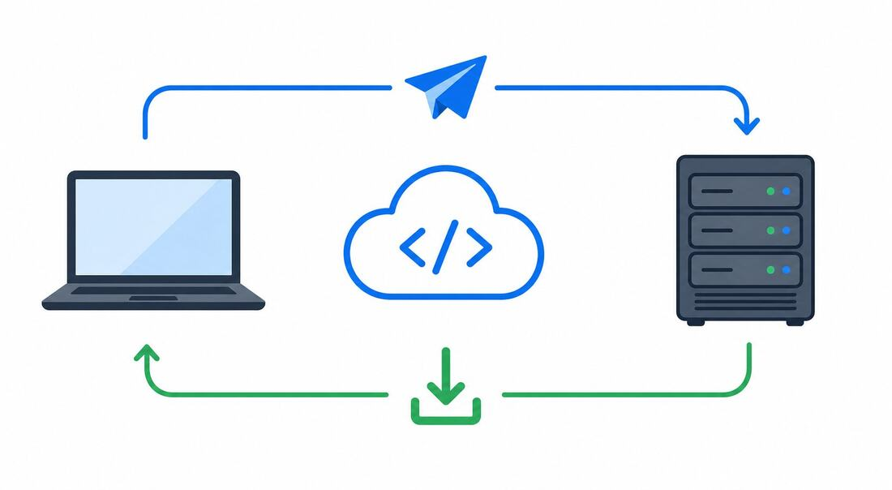
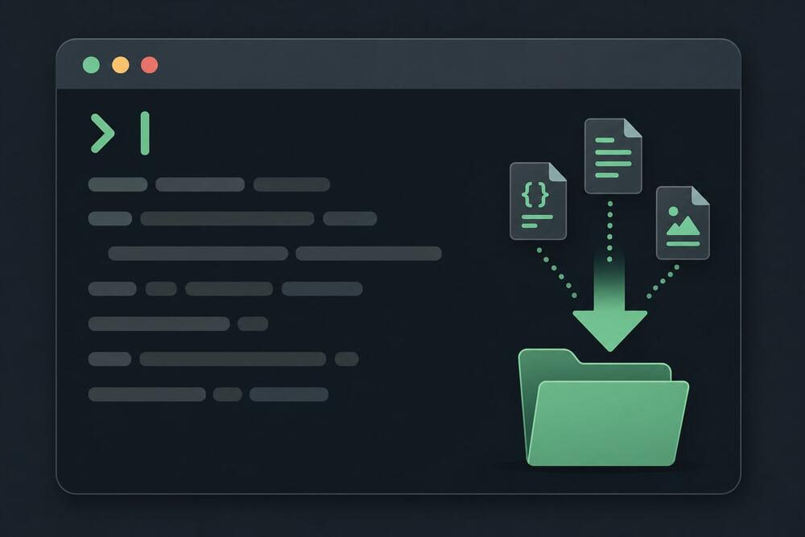
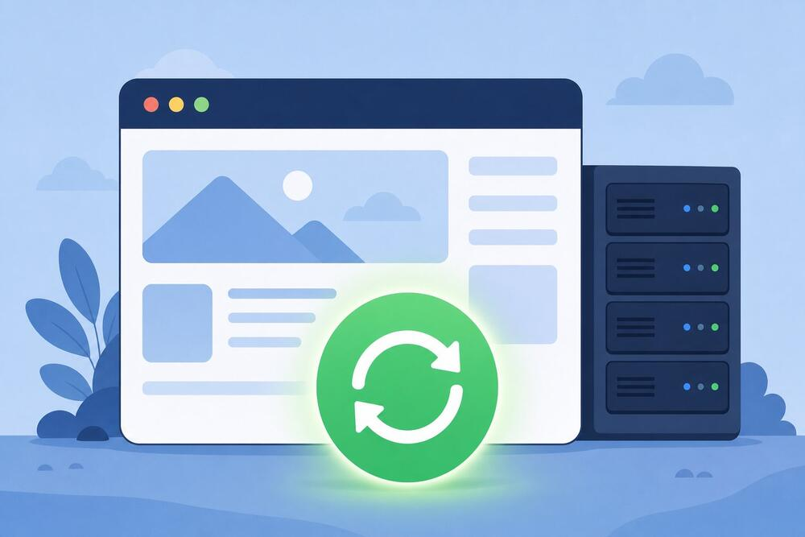

<!--
Post for Blogger (Free Stack Hub)


*The old way and the new way, side by side.*

I deleted my entire website three times in one month. Every time it worked, which is exactly what made the habit so hard to question. Then four months of data vanished in about six seconds, by me, on purpose, while I was trying to be productive.

<!-- jump break: in Blogger put the cursor here and use Insert > Jump break -->

TITLE:  Stop Deleting Your PythonAnywhere Files on Every Update. Use Git Instead.
LABELS: PythonAnywhere, Git, GitHub, Flask, Deployment, Web Development
SEARCH DESCRIPTION: Still deleting and re-uploading your PythonAnywhere project on every update? Here's the Git workflow that replaces it with one command.

IMAGES: keep the 4 files in ./images/ and reference them by bare file name in
post.html; the build rewrites them to public CDN URLs. Nothing is uploaded by hand.

HOW TO PUBLISH: python3 tools/build_import.py <folder>, then import that folder's
import.xml (Blogger > Settings > Manage blog > Import content). paste.html is the
body-only fallback and loses title/labels/description. Verify with
python3 tools/check_published.py <folder>.  Videos: python3 tools/make_video.py <folder>.
-->

# Stop Deleting Your PythonAnywhere Files on Every Update. Use Git Instead.

The routine went like this. I'd build a small Flask app on my laptop, upload it to PythonAnywhere through the Files tab, one file at a time. A week later I'd fix a bug or add a page, log back in, select everything in the project folder, hit delete, and upload the whole thing again from scratch.

And it worked. Every single time. That's the trap: a habit that keeps paying off never looks like a risk.

Then one evening I re-uploaded a project and completely forgot that my SQLite database and the whole uploads folder were sitting in that same directory. Gone. Four months of data, wiped in about six seconds, by me, on purpose, while trying to be productive.

That night I sat down and set up Git properly, and I haven't touched the delete button on a server since. If you're running a Python app on a PythonAnywhere free account and still doing the delete-and-reupload dance, this is the shortcut I wish I'd had. It takes ten minutes to set up once. After that, every update is one command.
## Why "delete everything, upload again" eventually blows up

On a tiny project, re-uploading everything feels harmless. It's six files. It takes two minutes and you get a little clean-slate feeling out of it.

The problem is that this approach has cracks, and your project grows straight into them.

**There's no undo button.** Say your new upload has a bug that only shows up on the live site, something you never saw on your laptop. Yesterday's version worked, today's doesn't, and the old working files? You overwrote them. Unless you kept backups somewhere (nobody does), your only option is to chase the bug forward.

**You can delete things you didn't mean to.** This is the one that got me. A live app collects stuff that exists only on the server: a database file, a folder of uploaded images, a `.env` file holding your API keys. Wipe the directory and all of that goes with it. Losing a `.env` hurts twice, because half the time you can't even remember every key that was in there.

**It scales terribly.** Six files is a small chore. Sixty files is an afternoon gone, plus the very real chance you forget one and spend your evening debugging a missing template instead of doing anything useful.

**You lose track of what changed.** A month into this cycle, can you say what's different between the version running right now and the one from two weeks ago? Neither could I. "What did I change recently?" is the first question you ask when something breaks, and delete-and-reupload makes it unanswerable.

None of this is a skill problem. It's just the wrong tool for the job.

## The mental switch: your server is a copy, not the original


*Code flows up to GitHub from your laptop, and down to PythonAnywhere with one pull.*

Here's the idea that makes everything click. From now on, your project lives in three places:

1. **Your laptop**, where you actually write code.
2. **GitHub**, which holds the official copy plus its full history.
3. **PythonAnywhere**, which holds a connected copy that serves visitors.

GitHub sits in the middle as the source of truth. You push code up to it from your laptop, and you pull it down onto the server. Files never travel directly between your machine and PythonAnywhere again. No more upload marathons, no more wondering whether the server copy matches what you think you deployed. It always matches, because it's the same repo.

You set this up once. Then it just runs.

## Step 1: clone your repo once

Log in to PythonAnywhere and open a **Bash console** (Consoles tab, then Bash). Type one command:

```bash
git clone https://github.com/your-username/your-repo.git
```


*One command brings the whole project down, history included.*

Git downloads the entire project into a folder named after your repo, and it arrives with its complete history attached. Every commit you ever made is now sitting on the server too, which quietly gives you that undo button you never had before.

If your repo is public, that's genuinely all there is to it. If it's private, GitHub will ask who you are, and your account password won't work there anymore. Create a **personal access token** on GitHub (Settings → Developer settings → Tokens) and paste it when git asks for a password. You deal with this once per clone and never think about it again.

Small tip: clone into your home directory, not some nested folder. Short paths save you headaches later when you're pointing the web app at your code.

## Step 2: every update after that is one command

The new routine starts on your laptop, not the server:

```bash
git add .
git commit -m "what you changed"
git push
```

Then, on PythonAnywhere, open a Bash console and run:

```bash
cd ~/your-repo
git pull origin main
```

That's the whole update process. A pull only downloads what actually changed since last time, so a CSS tweak moves a few kilobytes instead of re-uploading eighty files. Git also stays inside the repo folder, which means your `.env`, your database, and your uploaded media are never in its way.

Compare that to the old cycle: select all, delete, confirm, re-upload, hope you didn't miss a file. There's no comparison.

## Step 3: reload the web app (the step everybody forgets)

Here's a classic. You pull, the console confirms the new code arrived, you refresh your site... and nothing changed.

The code is on the disk, but your app is still running the old version from memory. PythonAnywhere keeps your web app alive as a long-running process, and it doesn't watch your files for changes. You have to tell it. Open the **Web** tab and hit the big green **Reload** button.


*Pull, then Reload. Every time.*

Refresh your site. New code is live, five seconds after you finished the pull.

One related gotcha worth knowing early: `git pull` moves code, not packages. If an update needs a new library, install it into your virtualenv on PythonAnywhere too, then reload. Forgetting this one produces `ModuleNotFoundError`, and it's almost always a package that exists on your laptop but not on the server.

## Keep it boring: one branch only

Sooner or later someone tells you to make a second branch "just in case." For a solo project, or a small team, ignore that advice for now. Do everything on `main`:

- Write and test code locally on `main`.
- Commit and push to `main` on GitHub.
- Pull `main` on PythonAnywhere.

Now "what's live?" has a one-word answer: whatever's on `main`. No merges to untangle, no guessing which branch is the real one, no deploying a feature branch by accident at midnight. There's plenty of time to learn branching later, when a project actually needs it. A free-tier deployment isn't that project.

## The one rule that keeps pulls conflict-free

A conflict only happens when both copies changed the same file in different ways and git can't pick a winner. On PythonAnywhere, that almost always traces back to one thing: someone edited a file directly on the server.

So there's really one rule to remember. **All edits happen before the push, never after the pull.**

In practice that means:

- Never hand-edit tracked files in a PythonAnywhere console. Treat the server as read-only from git's point of view.
- Do all coding locally (or wherever your dev environment lives), push to GitHub, then pull on the server.
- Keep server-only files, like `.env`, `db.sqlite3`, and your media folder, listed in `.gitignore`, so git never tracks them and never overwrites them.

Follow that and `git pull` applies cleanly every single time. Mine hasn't thrown a conflict in over two years of doing exactly this.

## When pull complains anyway

Two situations cover most of what you'll ever see.

**"Your local changes to the following files would be overwritten by merge."** Something touched a tracked file on the server. If the change doesn't matter, throw it away and pull:

```bash
git checkout -- filename
git pull origin main
```

Be aware that `git checkout --` discards that file's server-side changes permanently, so only run it when you're sure nothing valuable is in there.

**"Already up to date" but the site still shows old stuff.** Git did its job. You skipped step 3. Reload on the Web tab. That's it, that's the fix, and you will forget it at least once anyway.

## Quick recap

1. `git clone` once, to set the project up on PythonAnywhere.
2. `git pull origin main` every time you ship updates.
3. Reload the app from the Web tab.
4. Stay on a single `main` branch.
5. Never edit code on the server. Push from local, pull on the server.

The delete-and-reupload habit feels safe because it's familiar, but it's quietly the riskiest thing in your workflow. The git route flips that: your history is preserved, your `.env` and database stay put, and deploying becomes a boring, repeatable, ten-second command. On a free tier with limited resources, boring is exactly what you want your deploys to be.

If you run anything on a free PythonAnywhere plan, do this before your next update. Ten minutes once, and the upload marathon is over for good. Next up: the `.gitignore` that keeps your `.env` and database off GitHub without breaking your app.
