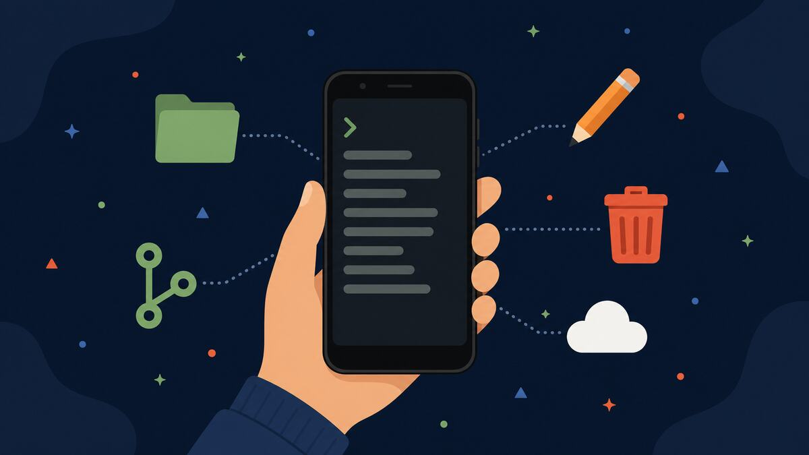
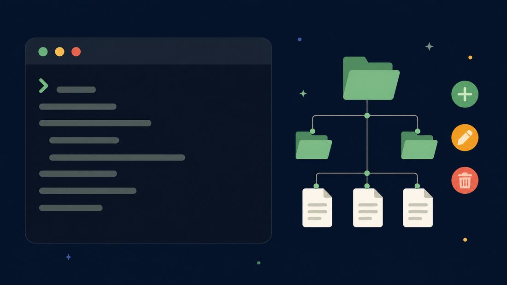
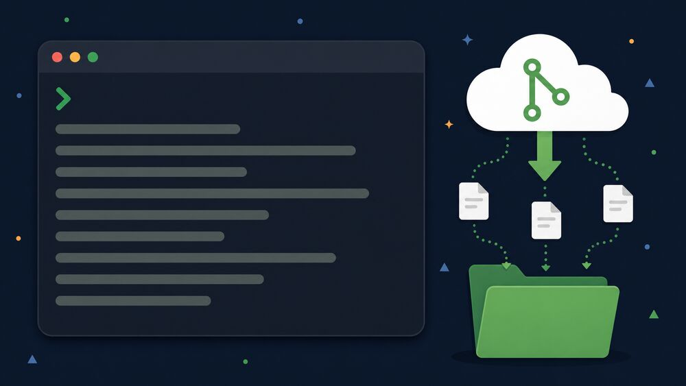
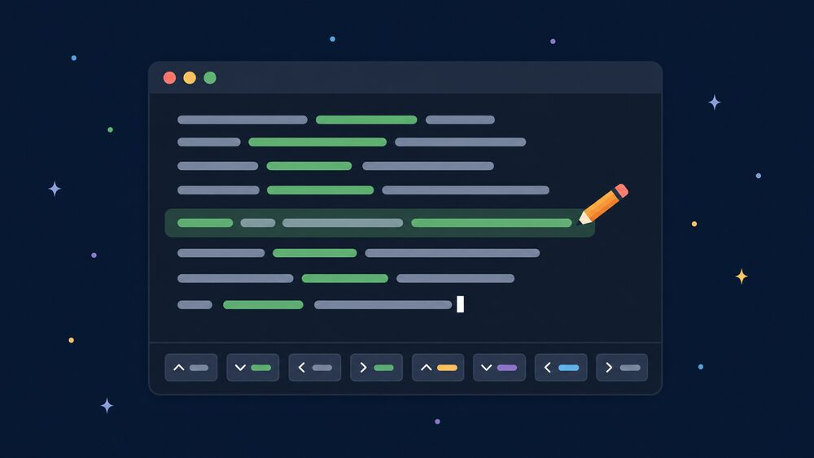

# Termux Commands Worth Memorising: Basics, Git Cloning and Nano on Android

*Labels: Termux, Android, Command Line, Git, GitHub, Nano — Published: 2026-09-17*


*One app, and your phone becomes a pocket Linux machine.*

I typed my first `ls` into Termux on a bus ride and felt like a hacker in a movie. Twenty minutes later I had deleted a folder I actually needed, because a phone terminal never warns you twice. Everything I now do daily on Android, from cloning repositories to editing config files with nano, came from fixing mistakes exactly like that one.

<!--more-->

Termux is a terminal emulator that gives you a real Linux environment on Android: a shell, a package manager, a file system and thousands of the same tools you would use on a desktop or a server. No root required, no custom ROM, just an app and a keyboard. The catch is that nobody hands you a map, so most people install it, type two commands, get lost, and uninstall it the same evening.

This is the map I wish I had had: the basic commands that cover ninety percent of daily work, how to install packages, how to clone and use Git repositories, and how to create, edit and delete files with nano. Every command here was typed on a phone, and every one of them still lives in my muscle memory.

## Install Termux from the right place first

Before any command, one warning that saves hours: the Termux build in the Google Play Store is years out of date and no longer maintained. Install the current version from [F-Droid](https://f-droid.org/packages/com.termux/) or from the official [Termux releases on GitHub](https://github.com/termux/termux-app/releases). Same app, same interface, but the Play Store copy fails on modern Android versions in ways that look like your fault and are not.

Once it is installed, open it and run these three lines, one at a time:

```
pkg update
pkg upgrade
termux-setup-storage
```

`pkg update` refreshes the list of available packages, `pkg upgrade` updates everything already installed, and `termux-setup-storage` asks for permission to see your phone's shared storage, then mounts it under `~/storage/shared`. Skip that last one and your terminal lives in a sealed box: real, but unable to hand files to the rest of your phone.

## The basic commands you will type every single day

A terminal is mostly two jobs: knowing where you are, and moving files around. These commands cover both, and they are identical to the ones you would use on any Linux machine:

```
pwd
ls
ls -la
cd projects
cd ..
cd ~
clear
mkdir notes
touch notes/todo.txt
cp notes/todo.txt notes/todo-backup.txt
mv notes/todo.txt notes/tasks.txt
rm notes/tasks.txt
```

Read them out loud and they explain themselves. `pwd` prints the directory you are standing in. `ls` lists what is inside it, and `ls -la` adds hidden files and details like sizes and dates. `cd` walks you into a folder, `cd ..` steps one level back out, and `cd ~` teleports you home, which in Termux means `/data/data/com.termux/files/home`. `clear` wipes the scrollback when the screen gets noisy.

The second half is file work. `mkdir notes` creates a directory called `notes`. `touch notes/todo.txt` creates an empty file, or updates the timestamp if it already exists. `cp` copies a file, `mv` moves or renames it, and `rm` deletes it. Those four verbs, plus `mkdir`, are the entire vocabulary of everyday file management. Learn them and the terminal stops feeling like a foreign country.


*Create, edit, delete: five commands cover the whole tree.*

## Installing packages: pkg is your app store now

Termux ships small on purpose. Everything else arrives through `pkg`, the package manager. Want Git, a text editor, Python or a chess game in your terminal? One line each:

```
pkg install git nano
pkg install python neofetch
pkg list-all
pkg uninstall neofetch
```

For this post, `git` and `nano` are the two that matter. `neofetch` prints a colourful summary of your device and exists purely to make you feel like the terminal is worth it, which, to be fair, it is. `pkg list-all` shows everything available when you want to browse, and `pkg uninstall` removes what you no longer need.

## Git on a phone: clone a repository and use it

Tell Git who you are once, and it stamps every commit you make from then on:

```
git config --global user.name "Your Name"
git config --global user.email "you@example.com"
```

Now clone. Point Git at any public repository and it downloads the whole project, history included, into a new folder named after the repo:

```
git clone https://github.com/your-username/your-repo.git
cd your-repo
ls
```


*One clone command pulls the project and its full history onto your phone.*

From inside that folder, the daily Git loop is five commands, and it never changes:

```
git status
git add .
git commit -m "fixed the readme"
git pull origin main
git push origin main
```

`git status` tells you what changed since the last commit. `git add .` stages everything in the folder, `git commit` records it with a message, `git pull` brings down changes made elsewhere, and `git push` sends yours up. If the repository is private, GitHub no longer accepts your account password there: create a personal access token in GitHub's settings and paste it when Git asks for a password. You do that once per clone and forget about it.

## Creating and editing files with nano

Cloning a repo is half the story; sooner or later you have to change a file on a phone keyboard. That is what nano is for. It is the friendliest editor in Termux: no modes, no memorised choreography, just text and a row of shortcuts along the bottom of the screen.

```
nano notes.txt
```

If `notes.txt` does not exist yet, nano opens a blank buffer and creates the file the moment you first save. Type normally, exactly like in any text field. The shortcuts that matter are four:

- **Ctrl+O** writes the file to disk (save), then press Enter to confirm the name.
- **Ctrl+X** exits nano, asking to save first if you changed something.
- **Ctrl+K** cuts the current line, and **Ctrl+U** pastes it back wherever the cursor is.
- **Ctrl+W** searches the file, which beats scrolling once a config grows past a screen.


*Nano keeps its shortcuts on screen, so you never have to remember them all.*

On a phone keyboard, Ctrl lives in Termux's extra keys row. If you do not see that row above your keyboard, switch it on once and it stays on:

```
mkdir -p ~/.termux
nano ~/.termux/termux.properties
termux-reload-settings
```

Inside that file, uncomment or add one line defining the extra keys, save with Ctrl+O, exit with Ctrl+X, then run `termux-reload-settings`:

```
extra-keys = [['ESC','/','-','HOME','UP','END','PGUP'],['TAB','CTRL','ALT','LEFT','DOWN','RIGHT','PGDN']]
```

That single line is the difference between editing a file on your phone and wrestling your phone. CTRL, ALT, ESC and the arrow keys, always one tap above the keyboard.

## Deleting files and folders without regrets

Deletion is where my bus-ride story went wrong, so here is the part most tutorials skip. There is no trash bin in a terminal. `rm` removes a file immediately and silently, and `rm -r` does the same to a folder and everything inside it:

```
rm draft.txt
rm -r old-folder
rmdir empty-folder
rm -i important.txt
```

`rmdir` only deletes a directory that is already empty, which makes it the safe choice when you are not sure what is inside. `rm -i` asks for confirmation before every single file, slow but forgiving. And the habit that would have saved my folder: before any risky `rm -r`, copy the folder somewhere with `cp -r`, or commit it to Git. A delete you can undo is just a move.

## Small habits that make Termux feel like a real machine

- **Learn the volume-key shortcuts.** Volume Up + E sends ESC, Volume Up + T sends Tab, and Volume Up + W, A, S, D are the arrow keys. Four combinations and nano stops fighting you.
- **Long-press the terminal** for the context menu: select text, paste, share output, and a More entry with the rest.
- **Swipe from the left edge** to open the sessions drawer and run several terminals at once, one for Git and one for editing.
- **Keep your setup in a repo.** Put `termux.properties`, your shell config and your nano config in a dotfiles repository; a fresh phone becomes yours again after one `git clone`.


*The whole workflow fits on one screen: install, navigate, clone, edit, back up.*

## Quick recap

1. Install Termux from F-Droid or the GitHub releases, never the stale Play Store build, then run `pkg update`, `pkg upgrade` and `termux-setup-storage`.
2. Eight commands cover daily file work: `pwd`, `ls`, `cd`, `mkdir`, `touch`, `cp`, `mv` and `rm`.
3. `pkg install git nano` adds version control and a text editor in one line.
4. `git clone` once, then live in the loop: `git status`, `git add`, `git commit`, `git pull`, `git push`.
5. `nano filename` creates or edits a file; Ctrl+O saves, Ctrl+X exits. Delete with care, because `rm` has no undo.

None of this needs a computer, a root hack or a paid app, just ten minutes with a keyboard on your phone. Open Termux tonight, clone one repository and change one line with nano; that single loop is the entire skill. Next up: the Termux packages worth installing after the basics, from Python and OpenSSH to running a small web server from your pocket.
