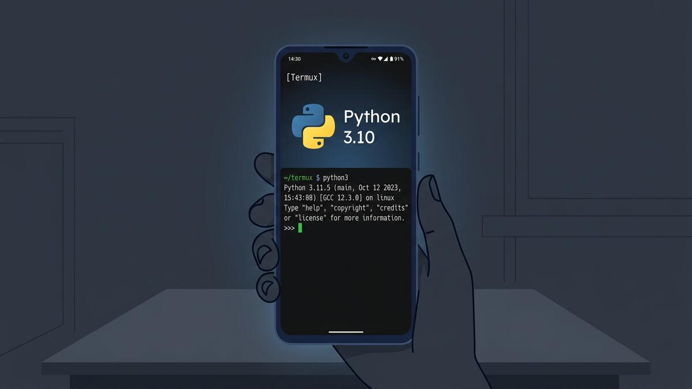
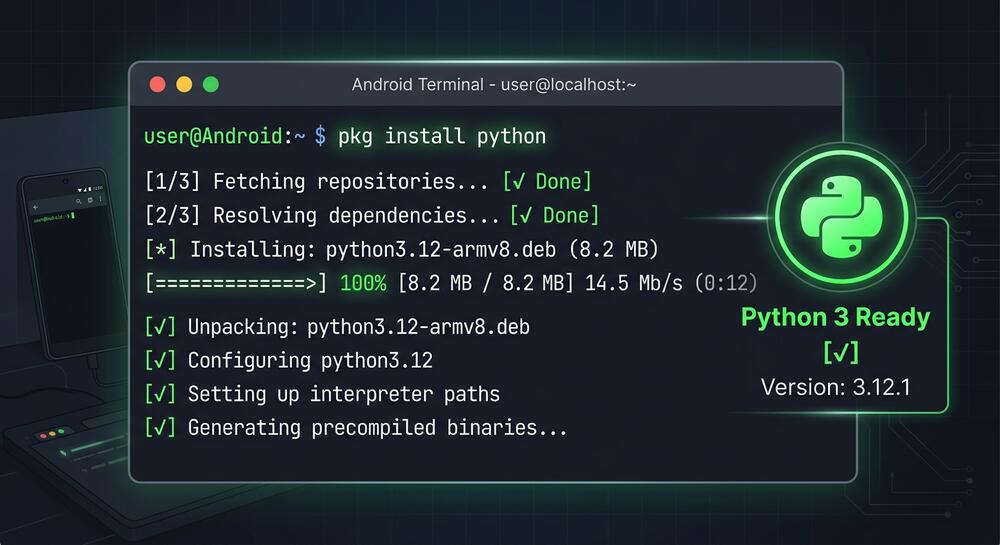
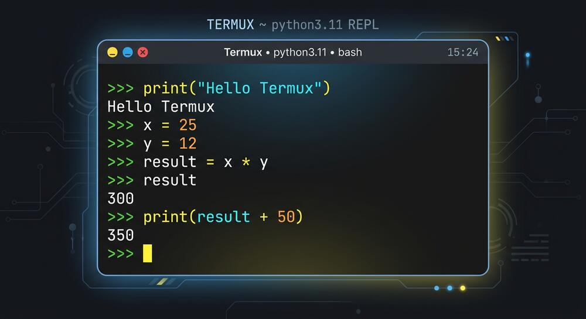
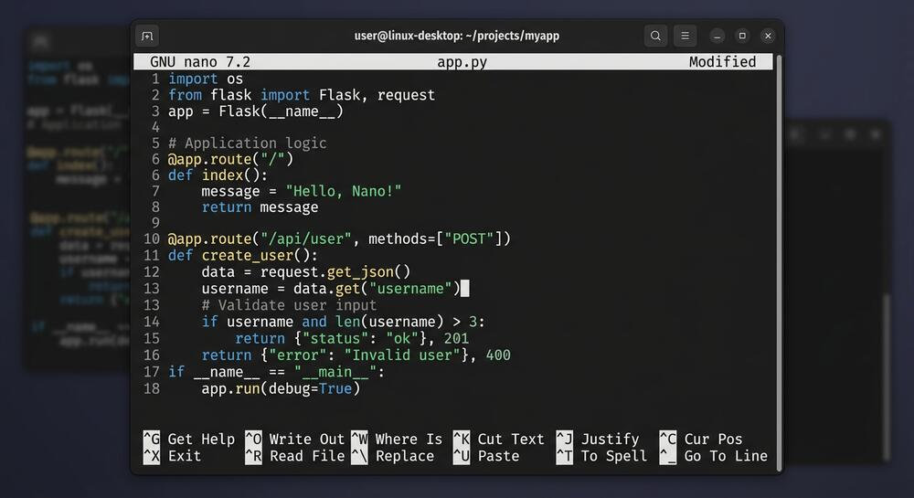
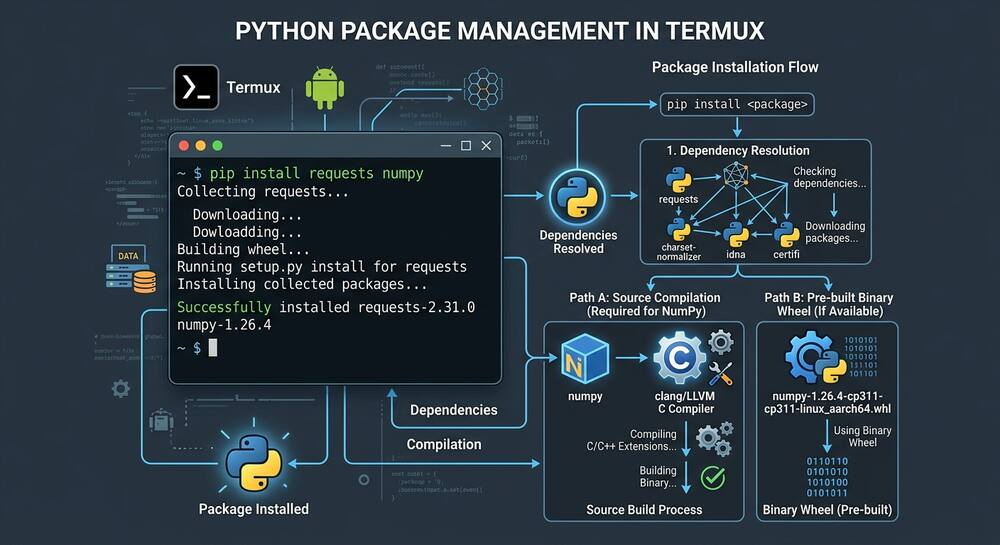
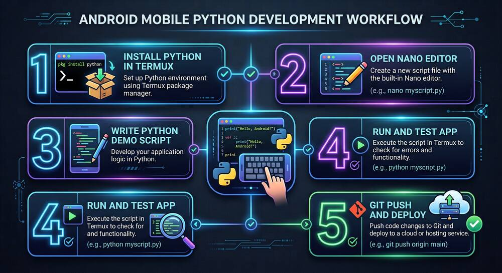

# Install Python in Termux: Build and Run Your First Python App with Nano on Android

*Labels: Termux, Android, Python, Command Line, Nano, Mobile Development, Free Stack — Published: 2026-09-19*


*Turn your Android phone into an autonomous Python workstation without root or paid tools.*

I tried running my first Python automation script inside Termux while waiting for a train and watched the screen freeze on a wall of compiler errors. Nothing was broken on my phone; I had simply missed the two build flags and Android-specific package requirements that mobile Linux demands behind the scenes. Once you understand how Python lives inside Termux's sandbox, writing, editing with nano, and executing production-ready scripts on your phone takes less than ten minutes.

<!--more-->

Having a complete Python runtime in your pocket changes how you think about development. You do not need to boot a laptop or pay for cloud compute to test an algorithm, scrape an API endpoint, automate bulk text files, or prototype a microservice. Termux gives you a real Linux userspace directly on Android, complete with standard POSIX system calls, a package manager, and native access to your device's filesystem.

Yet for most developers, their first attempt ends in frustration. Python scripts fail because of invisible tab-versus-space indentation mismatches on touch keyboards, package installations fail during C-extension compilation, or scripts vanish when switching apps. This comprehensive guide walks you through every layer of the setup: installing the latest Python runtime, configuring nano for clean Python syntax and indentation, building a full-featured interactive demo application from scratch, running it from the command line, and linking your mobile workflow to professional developer tools.

If you are completely new to Termux or need to set up storage permissions and navigation keys first, start with [our step-by-step guide to essential Termux commands, Git cloning, and nano on Android](https://freestackhub.blogspot.com/2026/09/termux-commands-git-nano.html). Once your terminal fundamentals are in place, you are ready to install Python.

## Step 1: Installing Python and Core Dependencies in Termux

Before installing any language runtime, always synchronise your package database with the official mirrors. Termux updates packages frequently, and attempting to install packages against a stale cache is the number one cause of broken package downloads:

```bash
pkg update && pkg upgrade -y
```

Once the system packages are up to date, install Python. In Termux, the package name is simply `python`, which pulls in the current Python 3 release, along with `pip` (the package installer) and essential shared libraries like SQLite3 and OpenSSL:

```bash
pkg install python -y
```

The installation typically takes between thirty seconds and two minutes depending on your internet connection and phone storage speed. Once the prompt returns, verify that the binaries are correctly registered in your path:

```bash
python --version
pip --version
which python
```

You should see `Python 3.11.x` or `Python 3.12.x` (depending on the repository version) and a path pointing directly inside Termux's isolated prefix at `/data/data/com.termux/files/usr/bin/python`. This path is crucial: unlike a standard desktop Linux distribution where binaries live in `/usr/bin`, Termux places all binaries inside its app data prefix so it can run without root permissions.


*A single pkg command delivers a full native Python 3 runtime and pip package manager.*

## Step 2: Exploring the Python Interactive Shell (REPL)

The quickest way to confirm that your Python environment can execute code is by launching the interactive Read-Eval-Print Loop (REPL). Type `python` into your terminal and hit Enter:

```bash
python
```

The terminal cursor will transform into the classic triple-arrow prompt (`>>>`). Here you can run immediate Python expressions, inspect system properties, and test logic before putting it into a script file. Try running these lines one by one:

```python
>>> print("Hello from Termux Python!")
>>> import platform, sys
>>> platform.system(), platform.machine()
('Linux', 'aarch64')
>>> 2 ** 32 - 1
4294967295
>>> exit()
```

Notice that `platform.machine()` prints `aarch64` on modern 64-bit Android smartphones. This confirms that your Python binaries are compiled natively for your phone's ARM processor, giving you near-native performance for mathematical calculations, data processing, and file operations.


*The interactive REPL lets you test logic, test regexes, and inspect mobile system stats instantly.*

To exit the REPL and return to the bash prompt, you can either call `exit()` or press **Ctrl+D** using the Termux extra-keys row above your software keyboard.

## Step 3: Configuring Nano for Painless Python Indentation

Interactive shells are great for one-liners, but real applications need script files. On a desktop computer, developers use IDEs with automatic indentation and linting. On mobile in a terminal, your best companion is GNU Nano: it is fast, lightweight, and requires zero memorised modal commands.

However, Python has a strict syntax rule that makes mobile coding notoriously tricky: **whitespace indentation matters**. If your mobile keyboard inserts a hard tab character on line 4 and four space characters on line 5, Python will immediately throw an `IndentationError: unindent does not match any outer indentation level`. By default, nano inserts tabs when you press the Tab key. We can fix this permanently by configuring nano's settings file.

Create or edit the global nano configuration file `~/.nanorc`:

```bash
nano ~/.nanorc
```

Type or paste the following configuration lines into the editor:

```
set tabsize 4
set tabstospaces
set linenumbers
set autoindent
set mouse
```

Here is why these five directives are a game changer for Python developers on mobile:

- **set tabsize 4:** Sets the tab stop width to four columns, matching PEP 8 standard Python conventions.
- **set tabstospaces:** Automatically converts every press of the Tab key into four distinct space characters, eradicating mixed-indentation errors forever.
- **set linenumbers:** Displays line numbers on the left margin so you can instantly spot where a traceback error occurred.
- **set autoindent:** Automatically matches the indentation of the previous line when you press Enter, saving countless keystrokes on mobile touchscreens.
- **set mouse:** Lets you tap on screen with your finger to position the text cursor exactly where you want it.

Save the file with **Ctrl+O**, press Enter to confirm, and exit nano with **Ctrl+X**. Every Python script you edit in nano will now follow strict whitespace standards automatically.


*With tabstospaces and line numbers enabled, nano becomes a clean mobile Python code editor.*

## Step 4: Building the Demo App: Pocket Task and System Monitor

Now let's build a real, useful demo application rather than a trivial one-line hello world. We will create **Pocket Tracker** (`pocket_tracker.py`): an interactive command-line application that allows you to manage tasks with persistent JSON storage on your phone and inspect real-time system metrics (timestamp, battery-friendly memory usage, and free disk storage).

Create a dedicated project directory to keep your workspace organised, navigate into it, and open the new script in nano:

```bash
mkdir -p ~/projects/pocket-app
cd ~/projects/pocket-app
nano pocket_tracker.py
```

Inside nano, write or paste the following complete Python program:

```python
#!/usr/bin/env python3
"""
Pocket Tracker: A demo CLI application built and executed in Termux on Android.
Features: Interactive menu, JSON task persistence, and system storage metrics.
"""

import json
import os
import shutil
import sys
from datetime import datetime

DATA_FILE = "tasks.json"

# ANSI color codes for clear mobile terminal visibility
CYAN = "\033[96m"
GREEN = "\033[92m"
YELLOW = "\033[93m"
RED = "\033[91m"
BOLD = "\033[1m"
RESET = "\033[0m"


def load_tasks():
    """Load existing tasks from JSON file or return an empty list."""
    if not os.path.exists(DATA_FILE):
        return []
    try:
        with open(DATA_FILE, "r", encoding="utf-8") as f:
            return json.load(f)
    except (json.JSONDecodeError, OSError):
        return []


def save_tasks(tasks):
    """Save tasks to local JSON file."""
    with open(DATA_FILE, "w", encoding="utf-8") as f:
        json.dump(tasks, f, indent=2)


def add_task(tasks):
    """Prompt user and record a new task with a timestamp."""
    print(f"\n{BOLD}--- Add New Task ---{RESET}")
    title = input("Enter task description: ").strip()
    if not title:
        print(f"{RED}Task cannot be empty!{RESET}")
        return
    task = {
        "id": len(tasks) + 1,
        "title": title,
        "created_at": datetime.now().strftime("%Y-%m-%d %H:%M"),
        "done": False,
    }
    tasks.append(task)
    save_tasks(tasks)
    print(f"{GREEN}Task #{task['id']} saved successfully!{RESET}")


def list_tasks(tasks):
    """Display all saved tasks in a formatted table."""
    print(f"\n{BOLD}--- Current Pocket Tasks ({len(tasks)}) ---{RESET}")
    if not tasks:
        print(f"{YELLOW}No tasks found. Use option 1 to add one.{RESET}")
        return
    for t in tasks:
        status = f"{GREEN}[DONE]{RESET}" if t["done"] else f"{YELLOW}[PENDING]{RESET}"
        print(f" {t['id']}. {status} {t['title']} {CYAN}({t['created_at']}){RESET}")


def complete_task(tasks):
    """Mark a specific task as completed."""
    list_tasks(tasks)
    if not tasks:
        return
    choice = input(f"\nEnter task ID to mark done: ").strip()
    for t in tasks:
        if str(t["id"]) == choice:
            t["done"] = True
            save_tasks(tasks)
            print(f"{GREEN}Task #{choice} marked as complete!{RESET}")
            return
    print(f"{RED}Task ID not found.{RESET}")


def show_system_stats():
    """Display real-time device storage and Python runtime statistics."""
    total, used, free = shutil.disk_usage(".")
    gb = 1024 ** 3
    print(f"\n{BOLD}--- Mobile System & Python Info ---{RESET}")
    print(f" Python Version : {sys.version.split()[0]}")
    print(f" Platform       : {sys.platform} (Android Linux userspace)")
    print(f" Working Folder : {os.getcwd()}")
    print(f" Storage Total  : {total / gb:.2f} GB")
    print(f" Storage Free   : {free / gb:.2f} GB ({free / total * 100:.1f}% free)")
    print(f" Storage Used   : {used / gb:.2f} GB")


def main():
    tasks = load_tasks()
    while True:
        print(f"\n{CYAN}{BOLD}==============================")
        print("  POCKET TRACKER - TERMUX CLI")
        print(f"=============================={RESET}")
        print(" [1] Add New Task")
        print(" [2] List All Tasks")
        print(" [3] Complete a Task")
        print(" [4] View Device Storage & System Stats")
        print(" [5] Exit")
        choice = input(f"{BOLD}Select an option [1-5]: {RESET}").strip()

        if choice == "1":
            add_task(tasks)
        elif choice == "2":
            list_tasks(tasks)
        elif choice == "3":
            complete_task(tasks)
        elif choice == "4":
            show_system_stats()
        elif choice == "5":
            print(f"\n{GREEN}Goodbye! Keep building on mobile.{RESET}\n")
            break
        else:
            print(f"{RED}Invalid option. Please enter 1 to 5.{RESET}")


if __name__ == "__main__":
    main()
```

Review the code inside nano. To save your work, press **Ctrl+O**, verify the filename `pocket_tracker.py`, and hit Enter. Then exit back to the terminal prompt by pressing **Ctrl+X**.

## Step 5: Running and Testing Your Python App in Termux

With your code saved to disk, you can execute it in two different ways. The direct approach is passing the filename as an argument to the Python interpreter:

```bash
python pocket_tracker.py
```

Alternatively, you can give your script direct executable permissions with `chmod`, allowing you to run it like any native command via the shebang line (`#!/usr/bin/env python3`) at the top of the file:

```bash
chmod +x pocket_tracker.py
./pocket_tracker.py
```


*The demo app in action: formatted menus, task persistence, and real-time device storage inspection.*

Try interacting with your new application:

1. Press **1** to add your first task: `Install Python in Termux`.
2. Press **1** again to add a second task: `Configure nano indentation rules`.
3. Press **2** to list your tasks and confirm they are listed as `[PENDING]` with timestamps.
4. Press **3** and select task ID `1` to mark it `[DONE]`.
5. Press **4** to see your smartphone's actual disk metrics and Python interpreter version calculated live.
6. Press **5** to exit the application.

Now check your project folder with `ls -la`. You will see a newly generated `tasks.json` file. Inspect its contents using `cat tasks.json`. Your data was safely serialized and saved to your device's persistent storage. Even if you reboot your phone or clear your terminal session, your Python application will load the saved state the moment you run it again.

## Step 6: Installing Third-Party Packages with Pip (and Avoiding the C-Extension Trap)

Python's built-in standard library is powerful, but modern development relies heavily on third-party packages from PyPI (Python Package Index). When you run `pip install` in Termux, packages fall into two distinct categories:

1. **Pure Python packages:** Libraries written entirely in Python (such as `requests`, `rich`, `click`, or `beautifulsoup4`) install effortlessly on Android without extra tools.
2. **Native C/C++ extension packages:** Libraries that compile native binaries (such as `numpy`, `cryptography`, `lxml`, or `pillow`) require an ARM C-compiler, Python header files, and build utilities.

If you try to install a package requiring compilation on a bare Termux setup, pip will throw errors mentioning `clang: command not found` or `error: command 'gcc' failed`. To prevent these failures, install the mobile build essentials upfront:

```bash
pkg install clang make python-pip -y
```

For packages like `cryptography` that depend on Rust, Termux also provides a native Rust toolchain via `pkg install rust`. In addition, Termux maintains pre-compiled binary packages for several heavy scientific libraries directly through `pkg`. For instance, rather than compiling NumPy from source with pip, you can install the optimized native build in three seconds using `pkg install python-numpy`.


*Installing clang and make ensures pip can build native C extensions and wheels directly on ARM64.*

Let's install the popular `requests` library to demonstrate fetching web data directly from your Termux Python script:

```bash
pip install requests
```

Test it with a quick one-liner that fetches your public IP address from the command line:

```bash
python -c "import requests; print('Public IP:', requests.get('https://api.ipify.org').text)"
```

If that command returns your network IP, your mobile Python setup is fully equipped to interact with modern REST APIs, cloud databases, and web services.

## Step 7: Connecting Your Mobile Scripts to the Cloud (Interlinking)

Building scripts in Termux is fast, but leaving code trapped on a single phone is risky. A lost device, broken screen, or accidental app uninstallation wipes your local files. The professional answer is connecting your Termux environment to a cloud workflow with Git.

Initialize a Git repository inside your `~/projects/pocket-app` folder, stage your files, and commit them:

```bash
git init
git config --global user.name "Your Name"
git config --global user.email "you@example.com"
git add pocket_tracker.py
git commit -m "initial commit: pocket tracker demo app"
```

This Git connection unlocks three vital capabilities across your entire developer stack:

First, it eliminates the dangerous "delete-and-reupload" habit. If you later take a Python script or Flask backend built on mobile and host it on free cloud infrastructure, follow the lessons in [our guide on stopping file deletion on PythonAnywhere and using Git instead](https://freestackhub.blogspot.com/2026/09/stop-deleting-pythonanywhere-files.html). Using a single `git pull` command updates your production server in seconds without ever risking your databases or upload directories.

Second, if you decide to expand your mobile Python script into a lightweight web dashboard using Python's built-in `http.server` or a microframework, you need to monitor performance and asset weights. Review our detailed breakdown in [Check Your Website's Vital Scores with PageSpeed Insights](https://freestackhub.blogspot.com/2026/09/pagespeed-insights-scores-explained.html) to see how server response time, render blocking, and image compression directly affect mobile user experience and Core Web Vitals.

Third, when your mobile tools, documentation, or technical projects are published online for public access, do not leave their visibility to chance. Learn how to verify site properties, submit sitemaps, and debug indexation by reading [Google Search Console from Zero: Add a Property, Inspect a URL, Request Indexing, Submit a Sitemap](https://freestackhub.blogspot.com/2026/09/google-search-console-step-by-step.html). A disciplined workflow connects pocket prototyping directly to discoverable web applications.


*From phone terminal to production: a five-step loop turns mobile experiments into robust software.*

## Troubleshooting Common Termux Python Errors

When developing in a mobile environment, you will eventually encounter a few quirks unique to Android's security architecture. Keep these solutions handy:

- **Permission Denied when saving outside Termux:** Android restricts background storage access by default. Run `termux-setup-storage` and grant the prompt permission. Your phone's internal storage will then be safely accessible under `~/storage/shared`.
- **error: externally-managed-environment:** In recent Python packaging updates, pip may block global installs to protect system packages. You can safely install packages for your user by adding the `--break-system-packages` flag (e.g., `pip install requests --break-system-packages`) or by creating an isolated virtual environment with `python -m venv myenv && source myenv/bin/activate`.
- **Script stops running when you lock the phone:** Android's aggressive battery optimizer will pause Termux processes when the display sleeps. Prevent this by running `termux-wake-lock` in your terminal or disabling battery optimization for Termux in Android Settings.
- **Accidental indentation errors:** If you copy code from a browser that has mixed tabs and spaces, open the file in nano and review each indentation level. With `set tabstospaces` in your `~/.nanorc`, hitting Tab will always insert four clean space characters.

## Quick recap

1. Update your package index with `pkg update && pkg upgrade` and install the runtime with `pkg install python`.
2. Configure `~/.nanorc` with `set tabstospaces` and `set tabsize 4` to prevent mixed-indentation syntax crashes.
3. Create your script using `nano filename.py`, write your logic, save with **Ctrl+O**, and exit with **Ctrl+X**.
4. Execute your app with `python filename.py` or grant execute permissions with `chmod +x filename.py`.
5. Install build tools (`clang` and `make`) before running pip, and push your code to Git so your mobile work seamlessly connects to production servers.

You now possess a full, native Python development station that fits in the palm of your hand. Open Termux today, create a project directory, and build a script that automates something in your daily workflow. The entire software engineering stack is accessible from your pocket.
