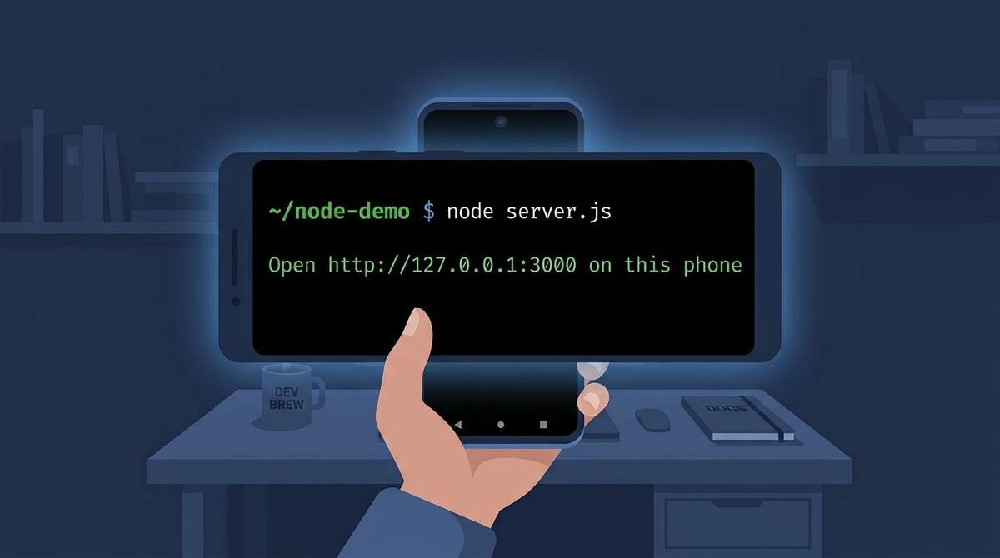
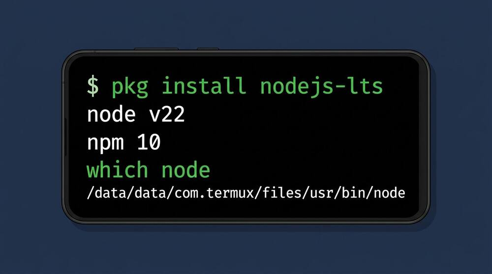
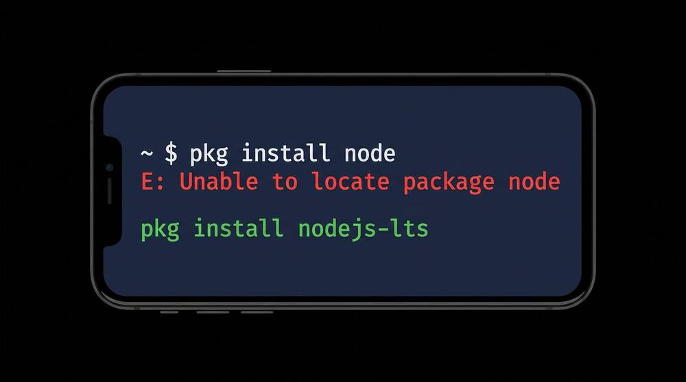
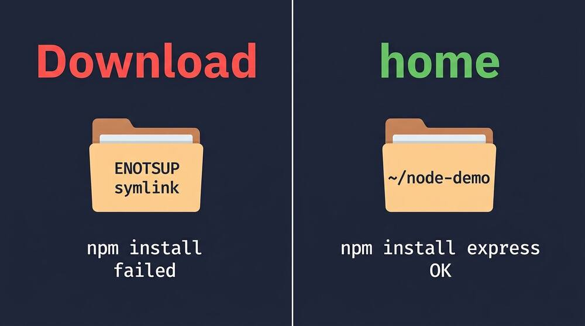
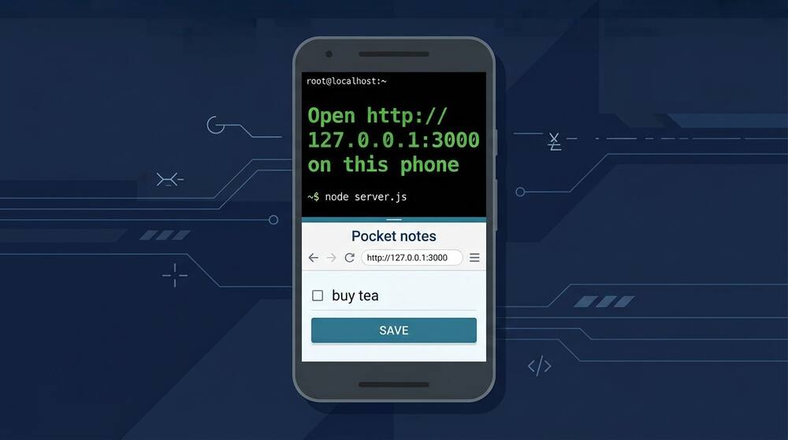
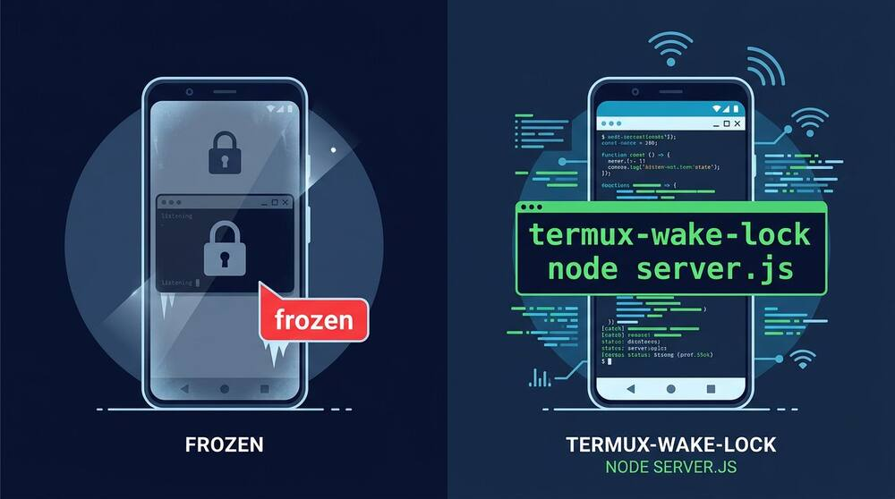
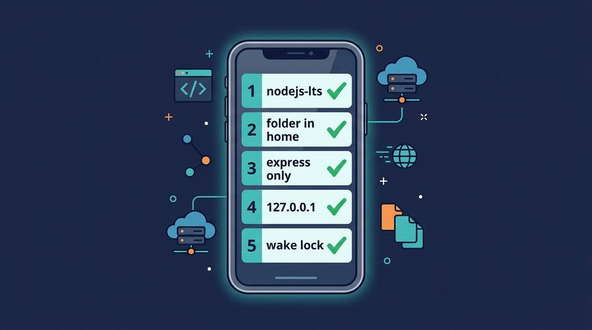

# How to run a Node app in Termux

*Labels: Termux, Android, Node.js, JavaScript, Command Line, Nano — Published: 2026-09-26*
*Target keyword: run a Node app in Termux*
*Live URL once imported: https://freestackhub.blogspot.com/2026/09/how-to-run-a-node-app-in-termux.html*


  *The server is up when that line is on screen, and not a moment before.*

I tried to run a Node app in Termux on the bus, typed npm install, and watched it die on a symlink error I had never seen on a laptop. The server that did start vanished the moment the screen locked, which looked like a crash and was not one. The package name in half the tutorials is wrong for this phone, and that is the smallest of the three traps.

If Termux itself is still new, do not start here. Storage permission, the extra-keys row, and nano are already covered in [the Termux commands worth memorising, including Git and nano](https://freestackhub.blogspot.com/2026/09/termux-commands-worth-memorising-basics.html). This post assumes those three work. Without them you will fight the keyboard instead of Node.

If you already followed [installing Python in Termux and building a first app with nano](https://freestackhub.blogspot.com/2026/09/install-python-in-termux-build-and-run.html), the phone setup is the same and the failures are not. Python's first wall was a compiler. Node's walls are a package that is not called what the tutorial says, a folder that cannot hold symlinks, and Android freezing the process when the screen goes dark.

## The three failures that look like Node is broken

Three errors account for almost every "Node does not work on my phone" thread. None of them is in the Node documentation, because none of them is Node's fault. Learn the shape of each one and the rest of the evening gets boring, which is what you want.

- **Wrong package name.** `pkg install node` fails immediately. The Termux package is `nodejs-lts`. There is no package called `node`.
- **Wrong folder.** A project under shared storage, Downloads, or the SD card cannot hold the symlinks npm creates. The install dies with `ENOTSUP` or `EPERM`.
- **Wrong diagnosis of a frozen process.** Lock the screen and the server stops answering. It did not crash. Android stopped scheduling it.

Desktop tutorials skip all three, because a laptop has a package named whatever the author typed, a filesystem that allows symlinks, and no one yanking the CPU when the lid looks closed. Copying those tutorials onto Android is how the bus ride ends.

## Install nodejs-lts, and do not install both

Update first. A stale package list is how Termux offers you a Node build that does not match the libraries already on the phone. Then install one Node, the long-term support build. npm comes with it. You do not install npm as its own package.

```
pkg update && pkg upgrade -y
pkg install nodejs-lts -y
node -v
npm -v
which node
```


  *One package. Two binaries. The path must sit inside Termux, not in /usr/bin.*

`which node` should print a path under `/data/data/com.termux/files/usr/bin`. That prefix is the whole story of why laptop instructions fail here. Termux is not a rooted Linux. It cannot write to `/usr`, and it does not use glibc. A Node binary you download from nodejs.org is built for glibc. It will not link. Do not "fix" a missing package by curling a tarball.

The error from the tutorial that says `pkg install node` is blunt, and it is the one to trust:

```
pkg install node
E: Unable to locate package node
```


  *That error is the tutorial's fault. The package was never called node.*

There is a second package, `nodejs`, which tracks current rather than LTS. My opinion: install `nodejs-lts` and stop. A phone server you still want next month does not need this week's language feature. The two packages provide the same command names, so installing the second one replaces the first and leaves you unsure which `node` just answered. If both are already installed, remove them and install only the LTS package:

```
pkg uninstall nodejs nodejs-lts -y
pkg install nodejs-lts -y
```

The uglier failure shows up after a half-finished upgrade. Node starts, then refuses:

> CANNOT LINK EXECUTABLE "node": library "libicui18n.so.77" not found

The number on the end moves. The meaning does not. The Node package and the ICU library were updated at different moments, and your mirror handed you one without the other. Run `pkg update && pkg upgrade -y`, then `pkg reinstall nodejs-lts -y`. If the upgrade itself cannot download, `termux-change-repo` and pick a single official mirror, then upgrade again. This is a packaging race, not a reason to install nvm.

Skip nvm. On a laptop it is a reasonable way to pin a version. On Termux it either compiles Node for a long, hot stretch or fetches a build that expects glibc, and you are back at the link error. The Termux package is already the build that matches the phone. A version manager here is how you lose the evening you meant to spend on the app.

## Put the project in home, not in shared storage

This is the symlink error from the bus. I had created the folder in `~/storage/shared/Download` because that is where the phone's file app can see it. npm then tried to create a symlink inside `node_modules` and Android's emulated storage refused. The message is some mix of `ENOTSUP`, `EPERM`, and `operation not permitted, symlink`. Nothing is wrong with the package. The folder cannot do what npm assumes every disk can do.


  *Same command, two folders. Only the one inside home can hold node_modules.*

Move the project and install there. Shared storage is for files you hand to other apps, not for the project itself.

```
mkdir -p ~/node-demo
cd ~/node-demo
npm init -y
npm install express
```

`termux-setup-storage` is still worth running, once, so you can copy a finished file out to the rest of the phone. It is the wrong place to keep `node_modules`, a git repo, or the notes file this app is about to write. Edit in `~/node-demo`. Copy out with `cp` when you actually need to share something.

express is pure JavaScript, which is why it is the right first dependency. `bcrypt`, `sharp`, and `canvas` are not. They compile C++ through node-gyp against a libc Termux does not use. The compile sits there long enough that the phone looks frozen, then fails. If a tutorial's first install is `bcrypt`, swap in `bcryptjs` until the server has answered one request. You can chase native addons after the page loads. Not before. Installing `build-essential` and `python` sometimes gets a native module through, and sometimes it does not. I would not spend that hour on a first app.

## The clean way to run a Node app in Termux

The app is a notes page you can open in the phone's own browser. One field, one list, a JSON file next to the script. It is small on purpose. A framework tutorial that starts with a database is how people end up debugging Postgres instead of the three traps above.

Create the file with nano. If the extra-keys row is missing, the commands guide shows how to turn Ctrl on. You will need Ctrl+O to save and Ctrl+X to leave.

```
nano ~/node-demo/server.js
```

```
const express = require("express");
const fs = require("fs");
const path = require("path");

const app = express();
const file = path.join(__dirname, "notes.json");
app.use(express.urlencoded({ extended: false }));

function readNotes() {
  try { return JSON.parse(fs.readFileSync(file, "utf8")); }
  catch (err) { return []; }
}
function esc(s) {
  return String(s).replace(/[&<>"]/g, (c) => ({
    "&": "&", "": ">", '"': """
  }[c]));
}

app.get("/", (req, res) => {
  const items = readNotes().map((n) => "- " + esc(n) + "").join("");
  res.type("html").send(
    "" +
    "Pocket notes" + items + "" +
    "" +
    "Save");
});

app.post("/add", (req, res) => {
  const text = String(req.body.text || "").trim().slice(0, 200);
  const notes = readNotes();
  if (text) notes.push(text);
  fs.writeFileSync(file, JSON.stringify(notes));
  res.redirect("/");
});

app.listen(3000, "127.0.0.1", () => {
  console.log("Open http://127.0.0.1:3000 on this phone");
});
```

The `esc` function is not decoration. A notes box that prints raw input is stored XSS the moment anything untrusted lands in it. On localhost, today, the only writer is you. The day you bind a wider address, that page is a public form. Escape on the way out, now, while the app is ten lines and you can still see the bug.

Listen on `127.0.0.1`, not `0.0.0.0`. Chrome on the same phone shares localhost with Termux, so `http://127.0.0.1:3000` opens the page. Binding every interface puts an app with no password on the café Wi-Fi. That is a later experiment, after the page loads, and only if another device actually needs to connect. A laptop browser pointed at `127.0.0.1` is talking to the laptop, not the phone. If the page fails from the laptop, that is the bind address doing its job.

```
cd ~/node-demo
node server.js
```


  *Same phone, two apps. Chrome is the client. Termux is the server. Leave the terminal running.*

Leave that session open. Closing Termux, or swiping it away, stops the server. If you want the process to restart when you save the file, try `node --watch server.js`. If Node answers `bad option: --watch`, the build is older than the flag and plain `node server.js` is the command. Do not reinstall a second Node to chase the flag.

A shebang of `#!/usr/bin/node` will not run here. The binary is not in `/usr/bin`. `#!/usr/bin/env node` works, because `env` searches `PATH`. For a first app, skip the shebang and type `node server.js`. Fewer moving parts.

## The screen lock is not a crash

You lock the phone, unlock it, and the page no longer loads. The terminal is still sitting on the listen line. Nothing printed an error. Android froze background CPU. Node did not exit. People then reinstall Node, which cannot help, because the process was never the thing that stopped.


  *The listen line is still there. Android stopped scheduling the process. That is not an npm error.*

Two different switches, and mixing them up wastes an hour. Turning off battery optimization for Termux, in Android settings, stops the system from killing the app outright. It does not, by itself, keep the CPU awake after the screen locks. That second job is a wake lock, and the command is not in the base Termux app.

```
pkg install termux-api -y
termux-wake-lock
node server.js
```

`termux-wake-lock` also needs the Termux:API add-on app, from the same place you installed Termux. If Termux came from F-Droid, the add-on has to come from F-Droid too. Mixing F-Droid and Play Store builds is a known way to get an add-on that cannot see the terminal. If the command is simply `not found`, the package or the add-on app is missing. That is not a PATH mystery inside your project.

Run `termux-wake-unlock` when you stop the server. A wake lock left on is how the battery is gone by morning. It is a decision for the hour you need the page, not a setting you leave armed. If you only needed the server while you were looking at it, you do not need the wake lock at all.

## Keep a second copy before you experiment

Termux lives in its own app data. Clear storage, or uninstall, and `~/node-demo` is gone. There is no trash bin. The phone is a copy, not the original. Commit before you try `0.0.0.0`, a native module, or a second Node package. Those are the three changes most likely to make you want yesterday's files.

```
cd ~/node-demo
git init
git add server.js package.json package-lock.json
git commit -m "pocket notes, localhost only"
```

Do not add `node_modules` or `notes.json` if the notes are only yours. A `.gitignore` with those two lines is enough. Push to a private repo when you have a network you trust. The reason this habit matters, written for a server but identical on a phone, is [stop deleting the only copy and use Git instead](https://freestackhub.blogspot.com/2026/09/stop-deleting-your-pythonanywhere-files.html). Uninstalling Termux is the same class of mistake as wiping a project folder to "redeploy".

## Errors worth recognising on sight

Match the words, then do the one fix. Reinstalling everything is how the actual message scrolls away.

- **Unable to locate package node.** `pkg install nodejs-lts`. There is nothing to locate under the other name.
- **CANNOT LINK EXECUTABLE, libicui18n.so.** `pkg update && pkg upgrade -y`, then reinstall `nodejs-lts`. Do not keep both Node packages.
- **ENOTSUP or EPERM, symlink.** The project is on shared storage. Move it under `~/` and run npm install again.
- **termux-wake-lock: not found.** Install the Termux:API app from the same store as Termux, then `pkg install termux-api`.
- **The page loads in the phone browser and not on a laptop.** You bound `127.0.0.1`. Leave it that way until you mean to share it.
- **gyp, node-gyp, or a compile that never ends.** A native addon. Switch to a pure-JavaScript package. express does not need a compiler.
- **EACCES on a global npm install.** Termux has no useful sudo. Install in the project, which is what `npm install express` already did. A global prefix is a later convenience, not a requirement for this app.


  *Five checks. If the server is down, one of these is the reason, not Node itself.*

## Quick recap

- Install `nodejs-lts` only. `pkg install node` was never going to work, and installing both Node packages replaces one with the other.
- Keep the project in `~/node-demo`. Shared storage cannot hold the symlinks npm writes.
- Use express, or any pure-JavaScript package. Leave bcrypt, sharp, and canvas until a page has loaded.
- Listen on `127.0.0.1:3000` and open that address in the phone's own browser. A laptop's localhost is a different machine.
- A silent server after lock is Android, not a crash. Wake lock only for the hour you need, and only after the Termux:API add-on is installed.

Tonight, run the five commands in home, save one note, and stop. Do not start with a native module, do not put the folder in Downloads, and do not point a tunnel at the phone until the page has loaded on localhost. The follow-up mistake is treating a frozen process as a broken install and reinstalling Node over a server that only needed the screen to stay awake.
